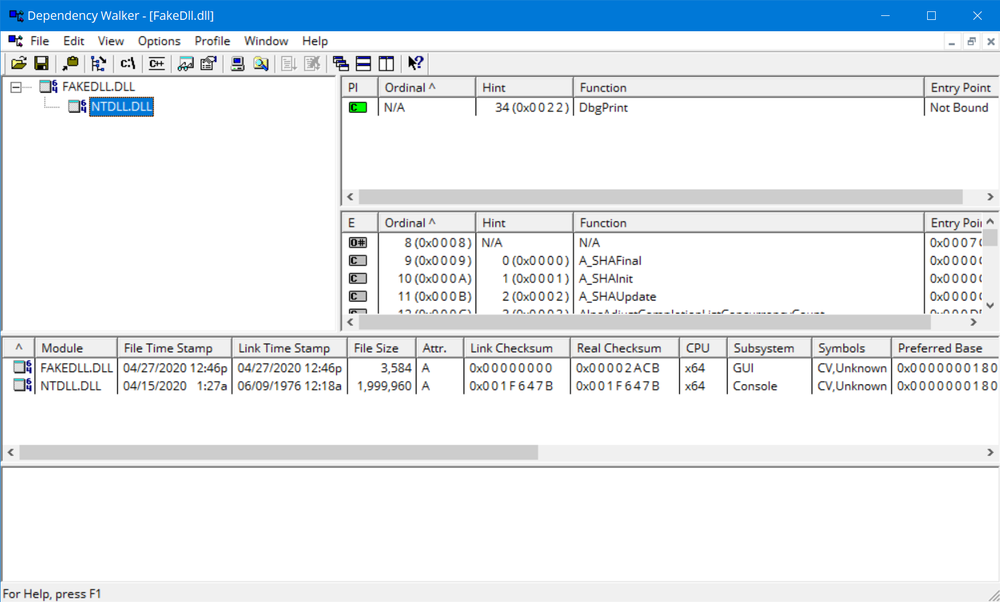

# Minimal Dependency DLL Project Template
This is just a simple DLL Visual Studio project that has only a dependency on ntdll. It is an early injection DLL template that allows you to 
extend as you see fit.

This project utilizes PHNTs project to expose the Native Layer API's (ntdll API's). As such if you want to keep it this way you can 
only use those API's. Of course, if you want to introduce additional dependencies you can by adding this to the `Properties -> Linker -> Input`
option in project settings.

I may add some example usage of the Native API's to do simple tasks, but for now I'll leave this project as is to allow the user to be free to extend.

Screenshot of DLL Dependency from depends:

